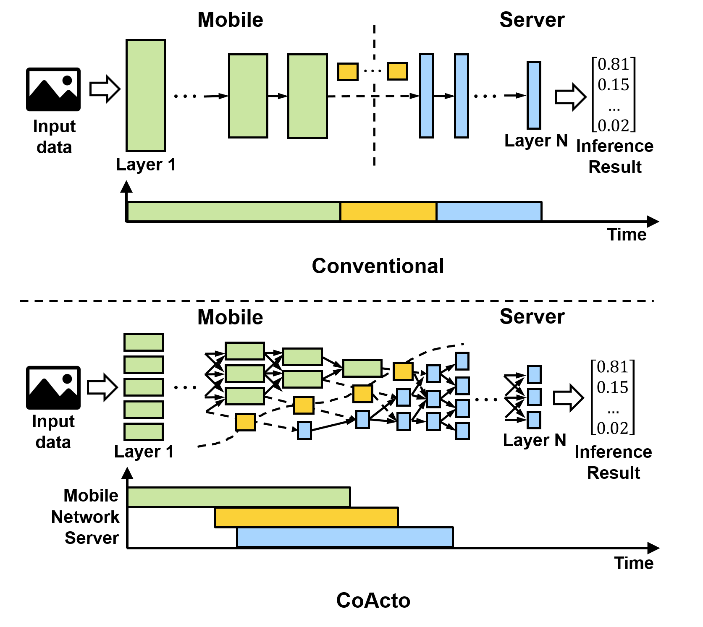

# CoActo

This repository provides source code for all of our evaluated benchmarks, along with scripts for the paper "*CoActive Neural Network Inference Offloading with Fine-grained and Concurrent Execution*" in ACM Mobisys'24. The source code includes the compilation on the target platforms, including x86 and ARM CPUs. 

## Overview
CoActo is a DNN execution system built from the ground up for mobile-server inference offloading. The key design philosophy behind our system is **Coactive DNN Inference Offloading**, which is a new, improved concept of DNN offloading that adds *fine-grained expression of DNNs* and *concurrency of runtime resources* to the existing collaborative inference.


## Pre-requisites
### 1. Hardware dependency
Our sourcecode must be compiled and run on x86 CPU with AVX2 support for server platforms, and on ARM CPU with NEON support for mobile platforms.
### 2. Software dependency
1. Make
2. GCC
3. Android NDK $\geq$ 25
4. Gengetopt $\geq$ 2.23
5. OpenMP
6. For the network bandwidth emulation, `Linux TC` should be installed on mobile platforms.

### 3. Models
Our scripts run 4 DNN models (VGG16, ResNet50, Bert-Base, and YoloV3). We provide the input file, the pre-generated tile-based computation graph, and their weight files on Google Drive (https://drive.google.com/drive/folders/1g7LFdX4vuJ7zGfH8gVNNs3rLBWQT1uhx?usp=sharing). Please download the `batched_input_128.bin`, and the `*.aspen` file of each model to the `data` directory before running the scripts.

## Installation and Compile
1. You can pull this repository.
   ```
   git clone https://github.com/Kmbin93/CoActo.git
   ```
2. Run `make` to compile our source code. Note that please disable AVX2 support and eable NEON support by modifying `AVX=2` and `NEON=1` in `Makefile` for ARM CPU. For Android platforms, please enable ANDROID flag as `ANDROID=1` in `Makefile` for corss-compile using ANDROID NDK.
   ```
   make -j8
   ```

## Running offloaded inference with binary `./coacto`
If you successfully compile our sourcecode, the binary program, `coacto` is generated. To run the program, each compiled binary program should be run in both host and client devices. Note that `device_mode` is an integer option for setting the target device as a host (0) or a client (1). The detailed usage is below:

```
$ ./coacto --help
Usage: coacto [OPTION]...
Experiment with multiple scheduling choices.

  -h, --help                    Print help and exit
  -V, --version                 Print version and exit
      --device_mode=INT         An integer option for setting the device mode
                                  of the program (0 - server, 1 - edge). For
                                  example, if you want to run the program as a
                                  server, device_mode is 0.
      --dirname=STRING          A directory path for storing the log files.
      --prefix=STRING           A prefix of the log files.
      --log_idx_start=INT       A start index of the log files.  (default=`0')
      --inference_repeat_num=INT
                                The number of inference repeation for running.
      --target_dnn_dir=STRING   Target dnn structure file (*.aspen) path
      --target_nasm_dir=STRING  Target dnn nasm file (*.nasm) path.
      --target_input=STRING     Target input file path. Default is
                                  data/batched_input_128.bin
                                  (default=`data/batched_input_128.bin')
      --server_ip=STRING        
      --server_port=INT         
      --schedule_policy=STRING  dynamic - CoActo, Local - Ondevice,
                                  conventional - Cloudonly, spinn - SPINN
                                  (possible values="dynamic", "local",
                                  "conventional", "spinn")
      --dse_num=INT             The number of computing engines of CoActo. It
                                  is recommended to use the number of CPU cores
                                  of the target platform.
      --num_edge_devices=INT    The number of edge devices for the multi-tenant
                                  experiment. For single-user scenario, it is
                                  1. Note that the host and the client should
                                  set same value as the server waits until the
                                  whole edge devices are connected before
                                  running inferences.
```

### Example of running VGG16

You can run directly `coacto` binary or alternatively running with the scripts (`run_coacto_host.sh` and `run_coacto_client.sh` in the host and the clinet) that prepared in `scripts` folder. For modification of arguments when running with the scripts, you can modify the arguments in the `sciprts/params.sh` file.

#### Host
```
./coacto --device_mode=0  
   --dirname=vgg16_test  
   --target_dnn_dir=data/vgg16_base.aspen 
   --target_nasm_dir=data/vgg16_B1_T200.nasm 
   --target_input=data/batched_input_128.bin 
   --server_ip=127.0.0.1 
   --server_port=8100 
   --schedule_policy=conventional 
   --dse_num=64 
   --inference_repeat_num=10 
   --num_edge_devices=1
```

or

``` 
./scripts/run_coacto_host.sh
```

#### Client
```
./coacto --device_mode=1
   --dirname=vgg16_test  
   --target_dnn_dir=data/vgg16_base.aspen 
   --target_nasm_dir=data/vgg16_B1_T200.nasm 
   --target_input=data/batched_input_128.bin 
   --server_ip=127.0.0.1 
   --server_port=8100 
   --schedule_policy=conventional 
   --dse_num=64 
   --inference_repeat_num=10 
   --num_edge_devices=1
```
or

```
./scripts/run_coacto_clinet.sh
```

## Running the experiment scripts
Our experimental scripts are stored in `mobisys24_artifact` directory. Basically, our experimental scripts run on the server side and run the binary of the mobile side by executing `ssh` command. Therefore, the server and the mobile should share the **ssh key pair to bypass entering the password** when running the `ssh` command.
Before running the scripts, please share the ssh key pair following the below instructions. 

> Note: Please modify the variable of `$edge_cmd` in `run_tests.sh` that contains the path of the cloned repository in the target client device before running the scripts.

Firstly, please generate public/private rsa key pair in host (server).

```
$ ssh-keygen -t rsa 
```

Then, deploy generated rsa key pair to the target mobile platforms and append `id_rsa.pub` to `authorized_keys` in target remote mobile platforms.

```
$ scp $HOME/.ssh/id_rsa.pub user@remote_domain:id_rsa.pub
$ cat id_rsa.pub >> ~/.ssh/authorized_keys
$ chmod 700 ~/.ssh/authorized_keys
```

To run all experiments in our paper, you can run bash script `run_tests.sh` file. The target mobile platforms and the server are connected through WiFi network. Note that compiled `coacto` and `main_fl` files must be prepared before running the scripts. The arguments of the scripts are below:

   * *num_runs*: The number of iterations of each run.
   * *server_ip*: IP address of server.
   * *server_port*: Port number of server for running our binary file. Our compiled binaries in mobile and server connect and communicate through this port number using Linux TCP.
   * *edge_username*: Username of mobile.
   * *edge_passwd*: Password of mobile. (Our scripts require superuser privilege to run Linux TC on mobile platforms.)
   * *edge_ip*: IP address of mobile to connect ssh.
   * *edge_port*: Port number of mobile to connect ssh.

### Example
```
$ cd mobisys24_artifact/e2e_compute_bottleneck
$ ./run_tests.sh <num_runs> <server_ip> <server_ip> <server_port> <edge_uname> <edge_passwd> <edge_ip> <edge_port>
```

## Evaluation and expected results
After running the scripts, a CSV file and output log file are generated in a `results` directory. The CSV file contains the end-to-end latency and transmission latency in milliseconds. Note that scheduling policy names in the binary and the CSV file, *conventional*, *spinn*, *fl*, and *dynamic*, indicate *Cloud-only*, *SPINN*, *FL-offloading*, and *CoActo*, respectively. Depending on the similarity of the tested platforms and network environments, you can observe the comparable speed-up of figures in our paper (1.3x compared to other baselines on average).